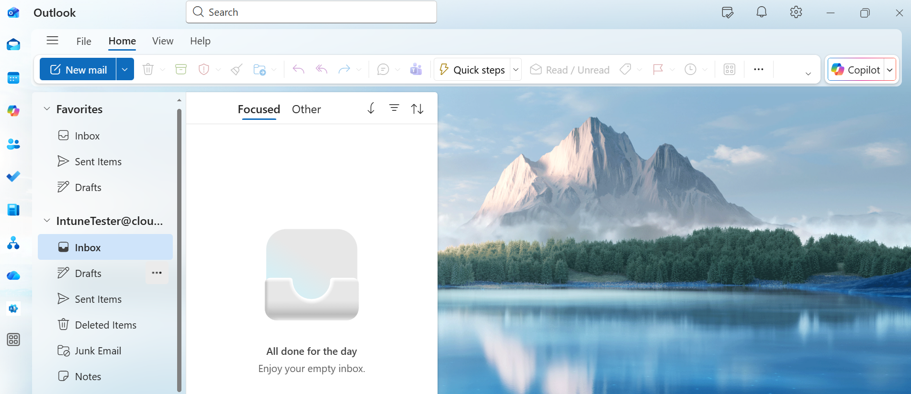

# Zero Trust: Enforcing Device Compliance with Conditional Access

## Background Scenario
In a modern "Work from Anywhere" environment, traditional perimeter security (firewalls and office networks) is no longer enough. Our organization faced a risk where users could access sensitive corporate data (Outlook, SharePoint, Teams) from personal, unmanaged, or "at-risk" devices.

**The Problem:** Even with a correct password and MFA, a user could be logging in from an unencrypted laptop with no antivirus, potentially exposing company data to malware or theft.

## Project Objective
The goal of this lab was to implement a **Zero Trust** "Verify Explicitly" model. We wanted to ensure that access to Cloud Apps is granted **ONLY** if:
1. The user's identity is verified.
2. The device they are using is recognized as a **Corporate Asset**.
3. The device is healthy and **Compliant** (Encrypted, Firewall active, etc.).

## Implementation Steps

### 1. Defining "Healthy" (Intune Compliance)
Created a Windows Compliance Policy in Microsoft Intune that marks a device as "Non-Compliant" if it fails any of the following:
- **Bitlocker:** Must be enabled for disk encryption.
- **Firewall & Antivirus:** Must be active and up to date.
- **Password Quality:** Minimum length and complexity requirements.

### 2. Building the Gatekeeper (Conditional Access)
Configured a Microsoft Entra Conditional Access policy with the following logic:
- **Assignment:** All Users (with a "Break-glass" exclusion).
- **Target Resources:** All Cloud Apps (Office 365 suite).
- **Device Filter:** Specifically targeted devices where `deviceOwnership` equals `Company`.
- **Grant Control:** Required the device to be **marked as compliant**.

## Key Learnings
- **User vs. Device Logic:** Conditional Access evaluates the *User* signing in, not the device object. To target hardware, you must use **Device Filters** within a User-based policy.
- **Session Caching:** Learned that "Revoking Sessions" is necessary when testing policy changes, as desktop apps use long-lived refresh tokens.
- **Transparency:** Zero Trust isn't about blocking people; it's about automated remediation. The system tells the user *exactly* why they are blocked so they can fix their own device health.

---

## Proof of Work: Lab Results

### Before Policy Enforcement
*The user is able to log into Outlook on a device that is clearly marked as "Non-Compliant" in the Intune portal.*

### After Policy Enforcement
*Once the CA policy was enabled and sessions were revoked, the same user is blocked. The system detects the non-compliant state and prevents access to the data.*

