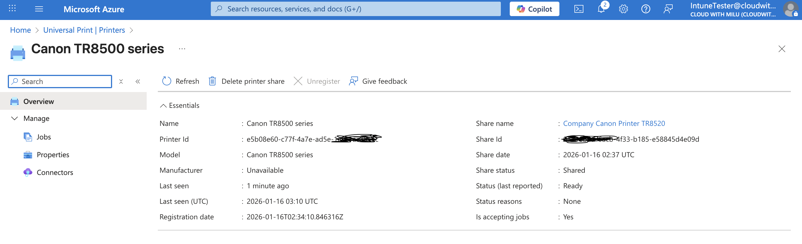

# Cloud Print Deployment: Canon PIXMA TR8520 via Microsoft Intune

##  Summary
This project demonstrates how to bridge the gap between consumer-grade hardware and enterprise device management. I successfully deployed a **Canon PIXMA TR8520** (a non-native cloud printer) to company-owned Windows 10/11 devices using **Microsoft Universal Print** and **Microsoft Intune**.

The goal was to provide a seamless "click-and-print" experience for employees on corporate-managed devices without requiring manual driver installations or local network discovery.

---

## What I Implemented
* **Hybrid Cloud Bridge:** Established a Universal Print Connector on a local Windows host to register legacy hardware into the Azure cloud.
* **Cloud Print Management:** Configured Printer Shares and access permissions within the Azure Portal/Entra ID.
* **Automated Provisioning:** Created an Intune Configuration Profile (Settings Catalog) to automatically "push" the printer to end-user devices.
* **Hardware Targeting:** Utilized Intune Filters to ensure the printer is only provisioned on **Corporate-owned** devices, maintaining security and policy compliance.

---

## Real-World Insights (What I Learnt)
* **User Context is Key:** I discovered that Universal Print provisioning in Intune is a **user-based** action. Assigning the policy to device groups causes it to fail; it must be assigned to User Groups.
* **Filtering for Precision:** To prevent the printer from installing on a user's personal home computer (BYOD), I learned to use **Intune Filters** to restrict deployment to company hardware only.
* **Consumer vs. Enterprise:** I learned that while consumer printers lack native Universal Print firmware, the **Universal Print Connector** is a robust workaround that makes any standard printer "cloud-ready."

---

## Steps Taken

### 1. Registering the Hardware
* Installed the latest Canon drivers on a local "bridge" PC.
* Installed and signed into the **Universal Print Connector**.
* Registered the Canon TR8520, which registered the device in the Azure Portal.

### 2. Sharing the Printer in Azure
* Navigated to **Universal Print > Printers** in the Azure Portal.
* Created a **Printer Share** for the registered Canon device.
* Assigned security permissions to the "All Users" group.
* **Note:** I captured the `Printer Share ID` and `Cloud Device ID` for the next phase.

### 3. Intune Policy Configuration
* Created a new **Configuration Profile** (Windows 10 and later > Settings Catalog).
* Added the **Printer Provisioning** settings.
* Entered the `Printer Share Name`, `Share ID`, and `Cloud ID`.

### 4. Deployment & Filtering
* Assigned the profile to the **Target User Group**.
* Applied a **Filter** to ensure the policy only runs on devices where `Ownership == Corporate`.

---

## Implementation Gallery

### Azure Portal: Printer Registration

### Universal Print: Printer Share Details

### Intune: Configuration Profile Settings

### Successful End-User Installation

