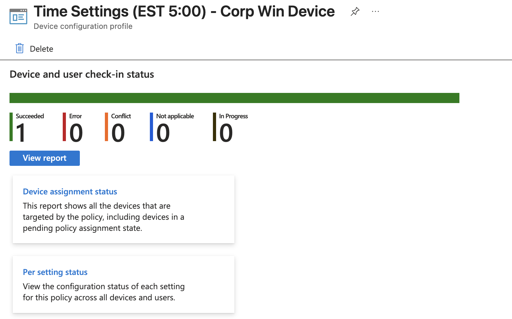

# Intune Configuration: Corporate Device Time Zone & Location Services

## Issue Description
After enrolling new **Corporate Windows Devices**, the system defaulted to the **UTC-08:00 (Pacific Standard Time)** time zone by default. 

### Obstacles:
1. **Permission Restriction:** Standard users were unable to manually change the time zone. The Windows Settings app displayed a message stating that an **Administrator** must sign in to make changes.
2. **Account Type:** Since the devices are Entra ID (Azure AD) joined, no local administrator accounts were created/available for manual overrides on the hardware.
3. **Location Services:** The "Set time zone automatically" toggle was disabled/greyed out by default, and location services were turned off at the system level.

## Solution Implemented
A new **Intune Configuration Profile (Settings Catalog)** was created and assigned to **All Corporate Devices** to automate the time and location configuration.

### Profile Name:
`Time Settings (EST 5:00) - Corp Win Device`

### Settings Configured:
| Category | Setting | Value | Purpose |
| :--- | :--- | :--- | :--- |
| **Time Language** | Configure Time Zone | `Eastern Standard Time` | Forces devices to EST regardless of default. |
| **System** | Allow Location | `Force Location On` | Unlocks the location sensor at the OS level. |
| **Privacy** | Let Apps Access Location | `Force Allow` | Enables the "Set time zone automatically" functionality. |

## Verification
- **Policy Assignment:** Assigned to the `Corporate Windows Devices` group.
- **Result:** Devices now automatically sync to Eastern Standard Time (EST) upon enrollment and first sync. The toggle for location services is now managed by the organization.

## Testing & Validation

To ensure the policy was applied successfully, the following tests were performed:

### 1. Intune Portal Confirmation
Verified that the device status shows "Succeeded" for the `Time Settings (EST 5:00) - Corp Win Device` profile.

### 2. Device Sync & Registry Check
On the test machine, a manual sync was performed via **Settings > Accounts > Access work or school**. 
- **Registry Key Verified:** `HKEY_LOCAL_MACHINE\SOFTWARE\Microsoft\PolicyManager\current\device\TimeLanguageSettings\ConfigureTimeZone`
- **Value:** `Eastern Standard Time`

### 3. User Interface Verification
The "Set time zone automatically" and "Location services" toggles are now active, and the "Admin needed" restriction has been removed for the time clock.

