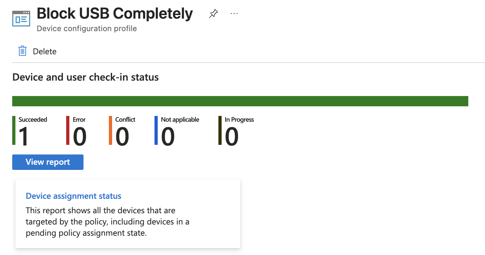
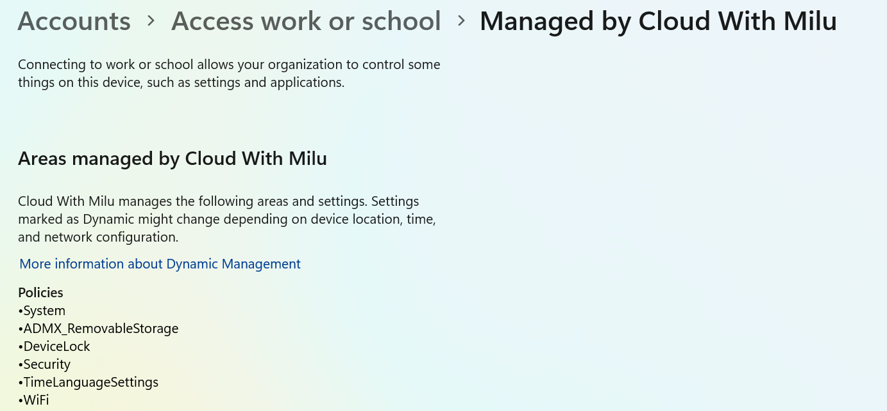
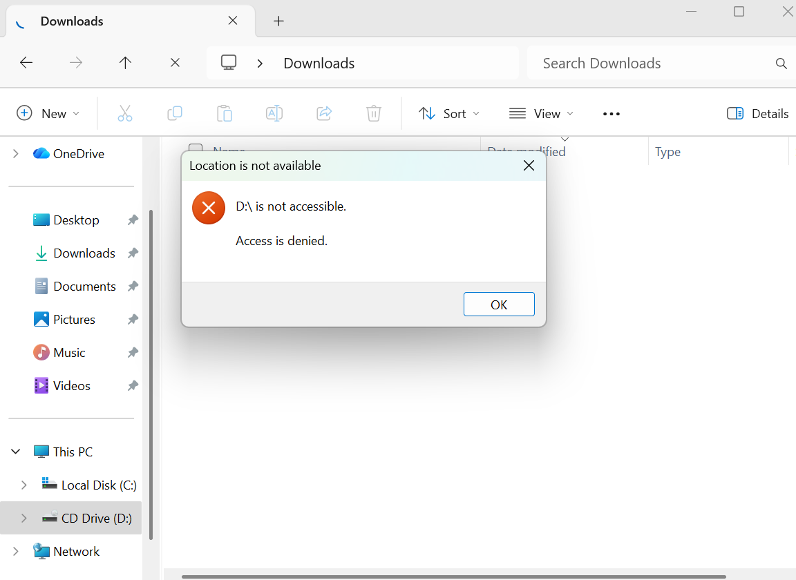
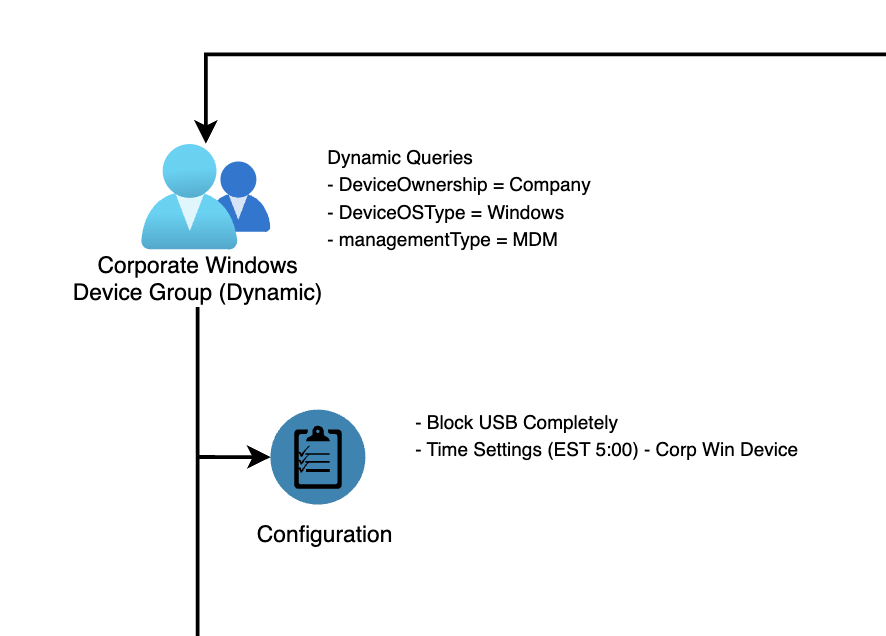

# Lab: Endpoint Security - USB Access Control via Configuration Profiles

## 1. Project Overview
In a corporate environment, unmanaged USB devices pose a significant risk for **Data Exfiltration** (stealing company data) and **Malware Infiltration** (introducing viruses). 
This lab demonstrates how to configure and deploy a **Configuration Profile** to manage how a workstation interacts with external storage.

### Objectives:
* Learn how to create a "Complete Block" policy for high-security environments.
* Learn how to create a "Read-Only" policy for flexible corporate environments.
* Understand the administrative workflow for deploying these hardware restrictions globally.

---

## 2. Business Scenarios: When to use these policies?

| Scenario | Policy Selection | Business Logic |
| :--- | :--- | :--- |
| **High-Security / Finance** | **Complete Block** | Prevents any physical data transfer. Essential for workstations handling sensitive PII (Personally Identifiable Information). |
| **General Office / Training** | **Read-Only Access** | Employees can view training videos or install drivers from a USB but cannot copy proprietary company files *out* to the drive. |

---

## 3. Architecture & Logic

Configuration Profiles work by sending instructions to the device's Operating System (OS). Once the profile is installed, the OS kernel enforces the rule, meaning even if a user has local admin rights, they often cannot override these hardware-level restrictions.

---

## 4. Step-by-Step Instructions (Manual Setup)

### Task 1: Creating a "Complete Block" USB Policy
*This policy ensures that when a USB drive is plugged in, the OS ignores it entirely.*

1.  **Log in** to the Microsoft Intune / Endpoint Manager admin center.
2.  Navigate to **Devices** > **Configuration profiles** > **Create profile**.
3.  **Platform:** Windows 10 and later.
4.  **Profile type:** Settings catalog.
5.  Click **Add settings** and search for **Administrative Templates\System\Removable Storage Access**.
6.  Select **All Removable Storage classes: Deny all access**.
7.  In the configuration settings, set this to **Enabled**.
8.  **Save and Assign** to your target Device Group.

---

### Task 2: Creating a "Read-Only" USB Policy
*This policy allows the user to see files but prevents them from saving or moving files to the USB.*

1.  **Create a New Profile** using the **Settings catalog**.
2.  Click **Add settings** and search for **Administrative Templates\System\Removable Storage Access**.
3.  This time, look for **Removable Disks: Deny write access**.
4.  In the configuration settings, set this to **Enabled**.
    * *Note: Ensure "Removable Disks: Deny read access" remains Disabled or Not Configured.*
5.  **Save and Assign** the profile to the appropriate group.

---

## 5. Conclusion
This is a **Zero Trust** model regarding physical hardware. Using the Settings Catalog provides the most granular control over how data moves in and out of the corporate ecosystem.

## 6. Verification

