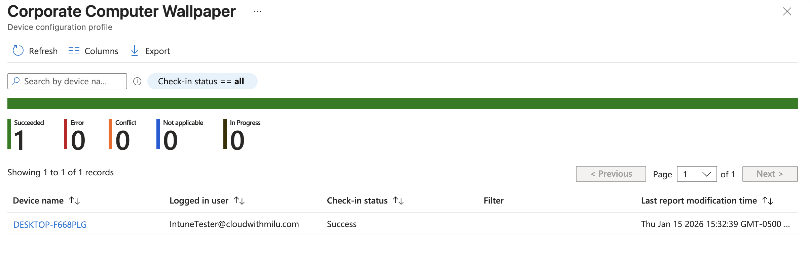
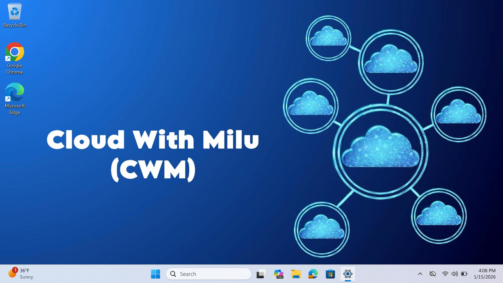

# Corporate Device Wallpaper Deployment via Microsoft Intune

This project documents the process of centrally managing and enforcing a corporate desktop wallpaper across all company-owned Windows devices using Microsoft Intune and GitHub as a content host.

---

## 📋 Summary
The goal was to standardize the visual identity of company-owned assets. By leveraging a **Configuration Profile** in Intune, we successfully enforced a branded desktop background, ensuring consistency across the fleet and preventing unauthorized changes.

## What I Did
1.  **Hosted Assets:** Uploaded the high-resolution corporate wallpaper to a public GitHub repository to serve as a reliable Content Delivery Network (CDN).
2.  **Generated Direct Link:** Extracted the "Raw" URL from GitHub to ensure Intune could download the image file directly without web-wrapper interference.
3.  **Configured Intune Policy:** Created a Windows 10/11 Configuration Profile using the **Settings Catalog**.
4.  **Targeted Deployment:** Assigned the policy to the **"Company Owned Devices"** group.
5.  **Verification:** Confirmed the policy status in the Intune portal and verified the visual change on end-user hardware.

## Steps Taken

### 1. GitHub Hosting
* Created a public repository.
* Uploaded the corporate image file.
* Obtained the raw link (e.g., `[https://raw.githubusercontent.com/...](https://raw.githubusercontent.com/mohammed-z-ali/Cloud-Labs-and-Projects-Portfolio/refs/heads/main/01.%20Intune/Configuration%20Profiles/Wallpaper/Github%20Wallpaper/CWM%20Wallpaper.jpg)`).

### 2. Intune Configuration
* **Path:** `Devices` > `Configuration` > `Create` > `New Policy`.
* **Platform:** Windows 10 and later.
* **Profile Type:** Template > Device Restrictions.
* **Setting Added:** `Personalization` > `Desktop Image URL`.
* **Value:** Pasted the GitHub Raw URL.

### 3. Assignment & Enforcement
* Assigned the profile to the specific device group: **Company Owned Devices**.
* Triggered a manual sync on a test machine to accelerate deployment.

## What I Learnt
* **CDN Requirement:** Intune requires a publicly reachable URL for image deployment; it does not host the image file itself within the policy.
* **Raw vs. Web URL:** Standard GitHub links lead to an HTML preview, which causes policy failure. The `raw.githubusercontent.com` domain is required for the OS to pull the actual image data.
* **Policy Application:** Learned how Intune overrides local user settings to maintain corporate branding standards on managed hardware.

## Proof of Deployment
Below is the screenshot showing the successful application of the policy:

 
 
*(Note: Upload your screenshot to the repository and name it "deployment-screenshot.png" for the image to appear above)*
