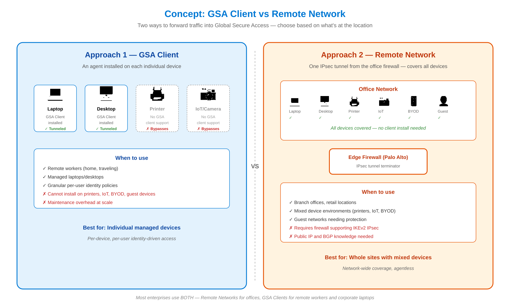
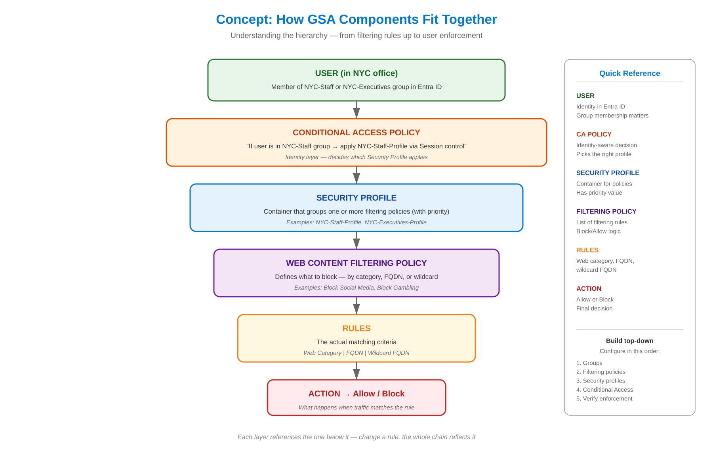
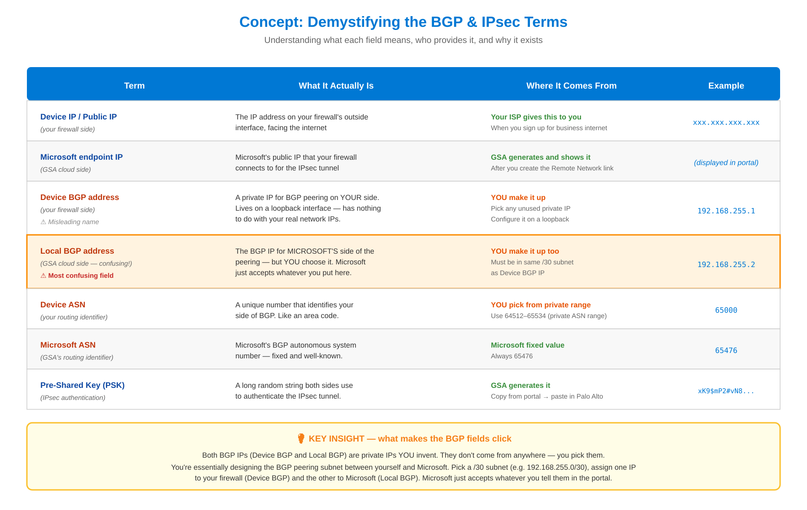
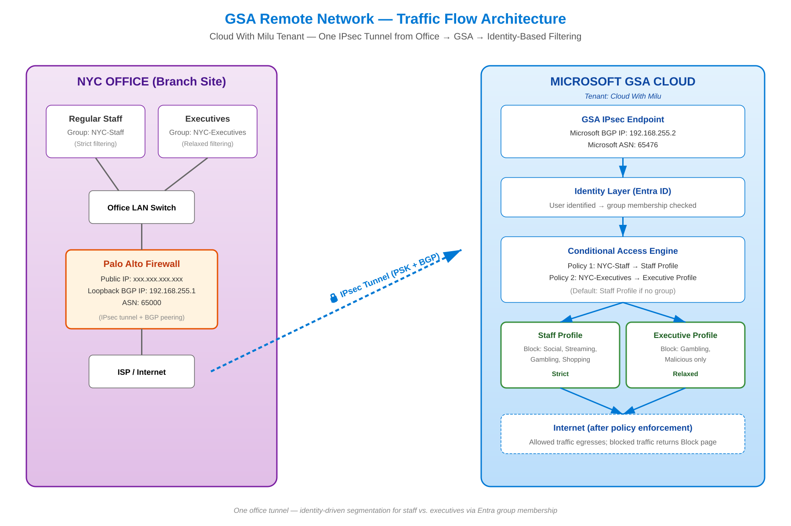
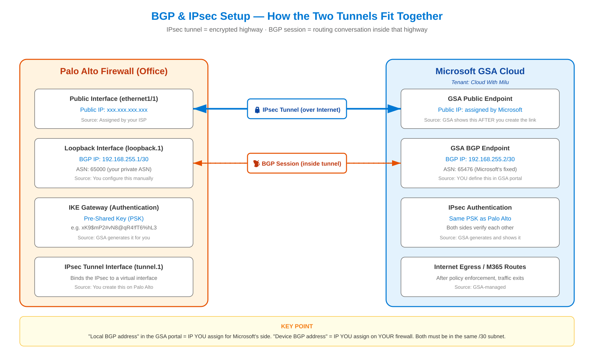
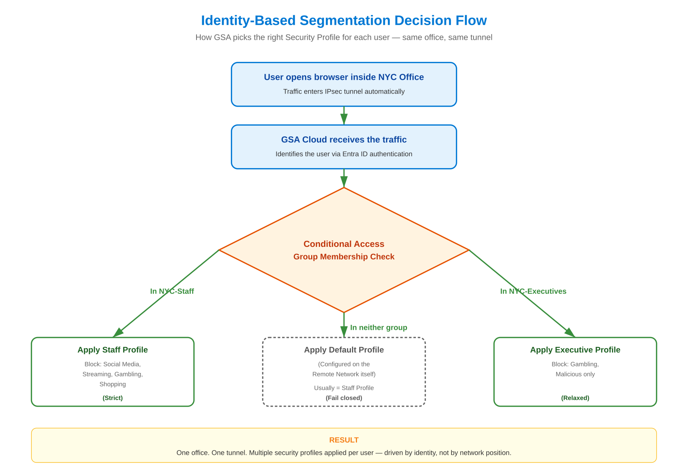

# Microsoft Entra Global Secure Access — Remote Networks Lab


## 📌 Project Overview

This project documents the configuration of **Microsoft Entra Global Secure Access (GSA) Remote Networks** — the enterprise feature that connects entire office locations to GSA via an IPsec tunnel from an edge firewall, instead of installing the GSA client on every device.

The lab demonstrates a real-world scenario: **one office, one IPsec tunnel, multiple security profiles applied per user role** (staff vs. executives) — entirely driven by Entra ID group membership rather than network position.

**Tenant:** `Cloud With Milu`

> **Note on scope:** I do not own a Palo Alto Networks firewall or the public infrastructure required to terminate a real IPsec tunnel from home. I do have hands-on experience configuring Palo Alto interfaces, IKE gateways, IPsec tunnels, and BGP at work. This lab covers the **GSA portal side** end-to-end — including the architectural design, IPsec/BGP parameters, identity-based segmentation, and Conditional Access enforcement. The Palo Alto-side configuration is documented as a reference, matching what would be deployed in production.

---

## 🧠 Concept — Why Use a Remote Network?

[](./Images/04-concept-client-vs-remote.png)

Two ways to forward traffic into GSA: install a client on every device, or terminate a single tunnel at the office firewall. Remote Networks make sense when you have mixed devices (printers, IoT, BYOD, guests) that can't run the GSA client.

---

## 🧠 Concept — How GSA Components Fit Together

[](./Images/05-concept-component-hierarchy.png)

Filtering rules sit at the bottom of a stack. Above them: filtering policies group rules; security profiles group policies; Conditional Access ties profiles to user groups; users sit at the top. Each layer references the one below it.

---

## 🧠 Concept — Demystifying the BGP & IPsec Terms

[](./Images/06-concept-terminology.png)

The most confusing part of Remote Networks is the BGP terminology. The "Local BGP address" field doesn't mean what it sounds like — it's the IP **YOU assign for Microsoft's side**. Both BGP IPs are private IPs you invent in the same /30 subnet.

---

## 🏗️ Architecture — Traffic Flow

[](./Images/01-traffic-flow.png)

A single IPsec tunnel from the Palo Alto firewall in the NYC office carries all branch traffic to GSA. Once traffic reaches GSA, the user is identified via Entra ID, and Conditional Access decides which Security Profile applies based on group membership.

---

## 🔧 Architecture — BGP & IPsec Setup

[](./Images/02-bgp-ipsec.png)

Two parallel sessions run between the Palo Alto firewall and GSA:

- **IPsec tunnel** — encrypted highway between the public IPs of both ends, secured by a Pre-Shared Key (PSK)
- **BGP session** — runs **inside** the IPsec tunnel between two private BGP IPs, exchanging routing information

| Field | Source | Example |
|---|---|---|
| Device public IP | Your ISP | `xxx.xxx.xxx.xxx` |
| Device BGP IP | You assign on Palo Alto loopback | `192.168.255.1` |
| Local BGP IP (Microsoft side) | You define in GSA portal | `192.168.255.2` |
| Device ASN | You assign | `65000` |
| Microsoft ASN | Microsoft fixed | `65476` |
| PSK | Generated by GSA | (long random string) |
| Microsoft endpoint IP | Generated by GSA after creation | (Microsoft public IP) |

---

## 🎯 Architecture — Identity-Based Segmentation

[](./Images/03-segmentation-flow.png)

The same office tunnel applies different security policies to different users based on Entra ID group membership. No VLANs needed — segmentation happens at the identity layer.

---

## ✅ What Was Configured

### 1. Entra Security Groups
- `NYC-Staff` — regular employees
- `NYC-Executives` — senior leadership

### 2. Web Content Filtering Policies
- **NYC-Staff-WebFilter** — blocks Social Media, Streaming, Gambling, Shopping
- **NYC-Executives-WebFilter** — blocks only Gambling and Malicious sites

### 3. Security Profiles
- **NYC-Staff-Profile** — links to NYC-Staff-WebFilter
- **NYC-Executives-Profile** — links to NYC-Executives-WebFilter

### 4. Remote Network
- **NYC-Office** — single IPsec link with:
  - Device public IP (Palo Alto outside interface)
  - Device BGP IP `192.168.255.1`
  - Local (Microsoft) BGP IP `192.168.255.2`
  - Device ASN `65000`
  - Internet Access + Microsoft 365 traffic profiles enabled
  - Default security profile = NYC-Staff-Profile (fail-closed)

### 5. Conditional Access Policies
- **NYC-Staff-Internet-Policy** — applies NYC-Staff-Profile to NYC-Staff group
- **NYC-Executives-Internet-Policy** — applies NYC-Executives-Profile to NYC-Executives group
- Admin account excluded from both policies

---

## 📚 Key Concepts Demonstrated

- **Remote Networks (Office Tunnel ZTNA)** — connecting branch sites without per-device clients
- **IPsec IKEv2** — authenticated and encrypted site-to-site tunnel
- **Pre-Shared Key (PSK) authentication** — IPsec identity verification
- **eBGP routing over IPsec** — exchanging routes between firewall and GSA
- **Loopback interfaces for BGP** — stable BGP peering source
- **Identity-driven segmentation** — multiple security profiles, one tunnel, driven by Entra groups
- **Fail-closed default policy** — restrictive baseline for users outside named groups
- **Conditional Access Session controls** — linking Security Profiles to user populations

---

## 🛠️ Palo Alto Configuration Reference

These are the configuration steps that would be performed on the Palo Alto firewall side (knowledge from professional experience):

### Loopback Interface
- `Network → Interfaces → Loopback → Add`
- Name: `loopback.1`
- IP: `192.168.255.1/30`

### IKE Gateway
- `Network → Network Profiles → IKE Gateways → Add`
- Peer IP: Microsoft endpoint public IP from GSA
- Authentication: Pre-Shared Key (paste PSK from GSA)
- IKEv2 with parameters matching GSA's published values

### IPsec Tunnel
- `Network → IPsec Tunnels → Add`
- Reference the IKE Gateway above
- Bind to `tunnel.1`

### BGP
- `Network → Virtual Routers → BGP`
- Local AS: 65000
- Peer Address: 192.168.255.2
- Peer AS: 65476
- Local Address: loopback.1 (192.168.255.1)

### Routing
- Default route via tunnel.1 for traffic destined to GSA-managed prefixes
- BGP-learned routes installed in routing table

---

## 🧱 Lab Environment

| Component | Details |
|---|---|
| Tenant Name | Cloud With Milu |
| Tenant Type | Cloud-only Microsoft Entra ID |
| License | Microsoft Entra ID P2 |
| GSA Portal | Configured end-to-end |
| Palo Alto Side | Documented (production knowledge) — not built locally |

---

## 📁 Repository Structure

```
📦 02-Remote-Networks
 ┣ 📂 images
 ┃ ┣ 📸 01-traffic-flow.png                 ← Architecture
 ┃ ┣ 📸 02-bgp-ipsec.png                    ← Architecture
 ┃ ┣ 📸 03-segmentation-flow.png            ← Architecture
 ┃ ┣ 📸 04-concept-client-vs-remote.png     ← Concept
 ┃ ┣ 📸 05-concept-component-hierarchy.png  ← Concept
 ┃ ┗ 📸 06-concept-terminology.png          ← Concept
 ┣ 📄 README.md
```

---

## 🎯 Skills Demonstrated

For Cloud Engineer / Cloud Administrator roles:

- ✅ Microsoft Entra Global Secure Access architecture
- ✅ Site-to-site IPsec design (IKEv2, PSK)
- ✅ eBGP over IPsec
- ✅ Identity-based network segmentation
- ✅ Conditional Access policy design
- ✅ Palo Alto Networks integration
- ✅ Zero Trust architecture for branch offices
